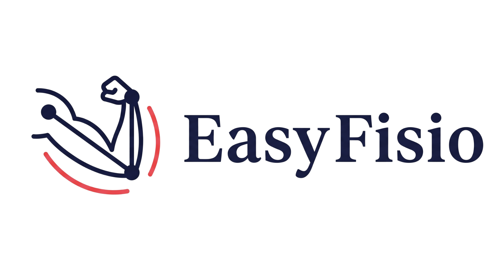

# EasyFisio




Biomechanical analysis of therapeutic exercises using computer vision. **100% client-side** — no servers, no API keys, everything runs in the browser.

Hacker: **David Alexis Garcia Espinosa** ([@Ironsss](https://github.com/Ironsss))

---

## What it does

Upload a video of a **bicep curl** and get:

- **8 clinical metrics** with automatic evaluation and actionable tips
- **Adaptive rep detection** via elbow angle analysis
- **Real-time skeleton overlay** with MediaPipe Pose annotations on your video
- **Optimal value comparison** — see where you are vs where you should be
- **Per-rep interpretation** — detailed findings for each repetition
- **Interactive charts** — time series, per-rep breakdown, and radar profile
- **Methodology tab** — every formula explained with LaTeX rendering (KaTeX)
- **Session history** (localStorage + demo mode with 6-week progression)

## Clinical Metrics

| Metric | What it measures | Optimal | Clinical use |
|--------|-----------------|---------|-------------|
| ROM | Elbow range of motion | 120–140° | Joint recovery |
| Angular Velocity | Neuromuscular control | 40–80 °/s | Spasticity, power |
| TUT | Time under tension | 3–5s/rep | Exercise dosage |
| C:E Ratio | Concentric vs eccentric tempo | 0.4–0.7 | Tendinopathies |
| Fatigue Index | ROM degradation across the set | < 10% | Load prescription |
| Trunk Compensation | Torso lean angle | < 5° | Technique, excessive load |
| CV (Consistency) | Variability between reps | < 5% | Motor control |
| Hold Time | Pause at peak contraction | 0.5–2.0s | Isometric strength |

Full documentation with formulas and references: [`docs/CLINICAL_METRICS.md`](docs/CLINICAL_METRICS.md)

## Features

### Skeleton Overlay
The analyzed video shows real-time MediaPipe Pose landmarks overlaid on playback:
- **Active arm** highlighted in red with elbow angle displayed in real time
- **Rest of body** shown in green (shoulders, torso, hips, legs)
- Toggle on/off with the Skeleton button

### Per-Rep Interpretation
Each repetition gets a score (Excellent/Acceptable/Improvable) with contextual findings:
- ROM comparison vs set average
- Trunk compensation assessment with correction advice
- Tempo analysis (concentric vs eccentric)
- Fatigue detection in late reps
- Isometric hold evaluation

### Optimal Value Bars
Every metric card shows a visual comparison bar: your current value vs the clinical optimal, with guidance on whether to increase or decrease.

### Methodology Tab
Full transparency on how every metric is calculated:
- Step-by-step pipeline explanation (pose detection → angles → reps → metrics)
- LaTeX-rendered formulas (KaTeX)
- Reference ranges with color coding
- Academic references for each metric

## Stack

- **React 18** + **Vite 5** — fast builds, instant HMR
- **MediaPipe Pose Landmarker** (WASM) — 33 landmarks, runs on browser GPU
- **Recharts** — interactive, responsive charts
- **KaTeX** — LaTeX formula rendering
- **Tailwind CSS** (CDN) — responsive out of the box
- **localStorage** — session history without a backend

## Quick Start

```bash
git clone https://github.com/platanus-build-night/platanus-build-night-26-mx-Ironsss.git
cd platanus-build-night-26-mx-Ironsss
npm install
npm run dev
```

Open `http://localhost:5173/rehab-motion/` in your browser.

## Deploy to GitHub Pages

1. Go to **Settings > Pages > Source** and select **GitHub Actions**
2. Push to `main` — the workflow in `.github/workflows/deploy.yml` handles the rest

## Architecture

```
src/
├── main.jsx              # Entry point
├── App.jsx               # Main app: upload, processing, dashboard, history, methodology
├── index.css             # Global styles + animations
├── analysis/
│   └── engine.js         # Analysis engine: MediaPipe + angles + adaptive rep detection + metrics
└── data/
    └── demoHistory.js    # Demo data: 6-week rehabilitation progression
```

## Tips for recording videos

- Film from the **side** (lateral view) for best detection
- Good **lighting** — avoid backlight
- The active arm should be **fully visible**
- **15-30 seconds** is enough for 8-12 reps
- Use a tripod or prop your phone for stability
